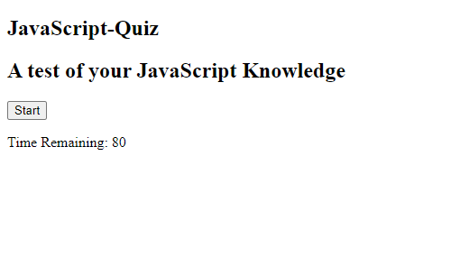
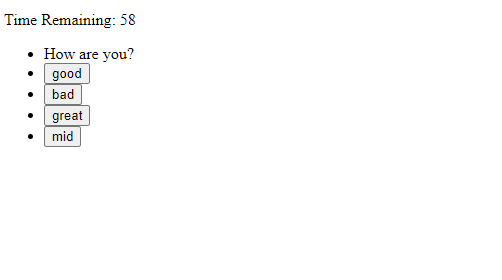

# <Your-Project-Title>

## Description

I started this project to further my knowledge of JavaScript, particlarly when it comes to the use of web API's. This project is supposed to be a timed quiz. Even though I did not finish making the entirety of the quiz (YET, I plan on coming back to this to finish it in the future), my understanding of JavaScript and APIs has significantly improved through working on this. I am confident that if I had a few more days I could have figured the rest of it out. 

## Installation

To install and run this project, simply pull it down from this repository and open it in your IDE of choice. From there go ahead and run it in your browser.

## Usage

To use this application, just click the start button and take the quiz!

I know it doesn't look pretty, I put all of my time into the JavaScript.

## Credits

Shout out to my tutor Andres Long and ssavage02 from ask BCS. They really helped me understand some concepts that I was struggling with. Andres specifically helped me make my quiz responsive, and ssavage02 from ask BCS helped me when it came to evaluating answers in the quiz.

## License

Copyright (c) <2023> <Benjamin Whann>

Permission is hereby granted, free of charge, to any person obtaining a copy
of this software and associated documentation files (the "Software"), to deal
in the Software without restriction, including without limitation the rights
to use, copy, modify, merge, publish, distribute, sublicense, and/or sell
copies of the Software, and to permit persons to whom the Software is
furnished to do so, subject to the following conditions:

The above copyright notice and this permission notice shall be included in all
copies or substantial portions of the Software.

THE SOFTWARE IS PROVIDED "AS IS", WITHOUT WARRANTY OF ANY KIND, EXPRESS OR
IMPLIED, INCLUDING BUT NOT LIMITED TO THE WARRANTIES OF MERCHANTABILITY,
FITNESS FOR A PARTICULAR PURPOSE AND NONINFRINGEMENT. IN NO EVENT SHALL THE
AUTHORS OR COPYRIGHT HOLDERS BE LIABLE FOR ANY CLAIM, DAMAGES OR OTHER
LIABILITY, WHETHER IN AN ACTION OF CONTRACT, TORT OR OTHERWISE, ARISING FROM,
OUT OF OR IN CONNECTION WITH THE SOFTWARE OR THE USE OR OTHER DEALINGS IN THE
SOFTWARE.